# 👋 Hi, I’m luobochuanqi!

🎓 Student · 💻 C++ & Java Enthusiast · 🛠️ Minecraft Player

  
  
  
  

---

## 🚀 About Me

- 📚 Currently a student, passionate about programming and continuous learning
- 💾 Proficient in C++ & Java, experienced with common algorithms and engineering practices
- 🕹️ Keen on Minecraft Mod / Plugin development, with years of server hosting and community operation experience

---

## 🏆 Featured Projects

- [LearnJavaGradle](https://github.com/luobochuanqi/LearnJavaGradle) — Progressive Java + Gradle library-management system practice
- [FishImmortality](https://github.com/luobochuanqi/FishImmortality) — Idle cultivation mini-game built with C++/Qt5
- [MinecraftMod-Mindustry](https://github.com/luobochuanqi/MinecraftMod-Mindustry) — Bringing Mindustry into Minecraft (NeoForge)
- [PaperPlugin-CheckPoints](https://github.com/luobochuanqi/PaperPlugin-CheckPoints) — Gameplay plugin for Paper servers
- [MinecraftMod-PlayTime](https://github.com/luobochuanqi/MinecraftMod-PlayTime) — Play-time statistics & visualization mod
- [Personal Website](https://github.com/luobochuanqi/luobochuanqi.github.io) — My digital space

---

## 🧰 Skills

|                       | Familiar                     | Understand A Little     | Just Learned |
| --------------------- | ---------------------------- | ----------------------- | ------------ |
| Programming Languages | C/C++, Java, Kotlin, Node.js | Python                  | Rust, Lua    |
| Frameworks/Engines    | Qt5, Forge/Paper             | OpenGL, Electron, Tauri | Vue, Flutter |

---

## 📫 Contact Me

- Bilibili: https://space.bilibili.com/500577206
- Email: luobochuanqi@qq.com

---

> “Code, create, and never stop exploring!”
