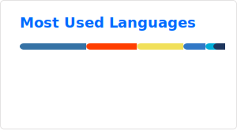

# 👋 Hi, I’m luobochuanqi!

🎓 Student · 💻 C++ & Java Enthusiast · 🛠️ Minecraft Player

  
  
  
  

---

## 🚀 About Me

- 📚 Currently a student passionate about programming and continuous learning
- 🤖 **AI & Multi-Agent Systems** — Building intelligent agents with LangChain/LangGraph (see [ai-jubensha](https://github.com/Zewang0217/ai-jubensha) & [ToThink](https://github.com/TooooThink/tothink))
- 💾 Proficient in **C++**, **Java**, **Kotlin** & **Python**, experienced with algorithms and software engineering
- 🕹️ Minecraft Mod/Plugin developer — working with **NeoForge**, **Forge**, and **Paper** APIs
- 🔧 Active contributor to open-source projects (LLVM)
- 🌱 Currently learning: Rust, advanced OpenGL, and distributed systems

---

## 🏆 Featured Projects

### 🚀 AI & Multi-Agent Systems

- [ai-jubensha](https://github.com/Zewang0217/ai-jubensha) — AI-powered murder mystery game platform with multi-agent collaboration (React + Spring Boot + LangChain)
- [ToThink](https://github.com/TooooThink/tothink) — PC Intelligent Agent: A Hierarchical Multi-Agent Collaboration Framework for Complex Task Automation (Python + Electron)

### 🔥 Active Development

- [MTurrets](https://github.com/luobochuanqi/MTurrets) — Mindustry-style turrets mod for Minecraft 1.21.1 (NeoForge + Kotlin)
- [MMindustry](https://github.com/luobochuanqi/MMindustry) — Bringing Mindustry factory gameplay into Minecraft
- [MinecraftMod-PlayTime](https://github.com/luobochuanqi/MinecraftMod-PlayTime) — Play-time statistics & visualization mod (NeoForge)

### 📚 Learning Projects

- [LearnJavaGradle](https://github.com/luobochuanqi/LearnJavaGradle) — Java OOP + Gradle library management system practice
- [FishImmortality](https://github.com/luobochuanqi/FishImmortality) — Idle cultivation mini-game with elixir & spirit stone system (C++/Qt5)

### 🎮 Minecraft Plugins & Mods

- [PaperPlugin-CheckPoints](https://github.com/luobochuanqi/PaperPlugin-CheckPoints) — For the King inspired checkpoint system for Paper servers

### 🌐 Personal

- [Personal Website](https://github.com/luobochuanqi/luobochuanqi.github.io) — Tech blog covering algorithms, C/C++ tips, and programming notes

---

## 🧰 Skills

| Category | Badges |
|----------|--------|
| **Languages** |         |
| **AI / ML** |    |
| **Frontend** |     |
| **Backend** |     |
| **Databases** |    |
| **Tools** |     |
| **Minecraft Dev** |     |

---

## 📫 Contact Me

- Bilibili: https://space.bilibili.com/500577206
- Email: luobochuanqi@qq.com

---

> "Code is poetry, bugs are just modern art. Keep building! 🚀"
